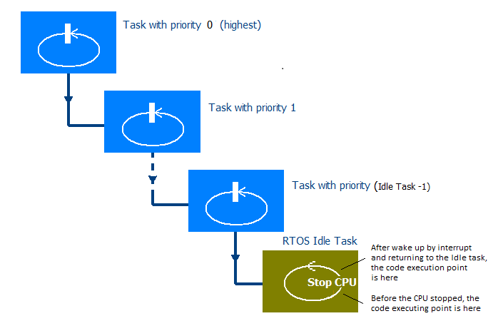
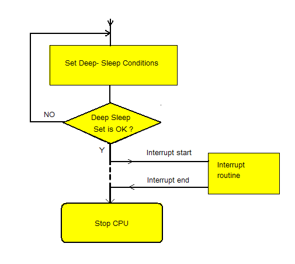
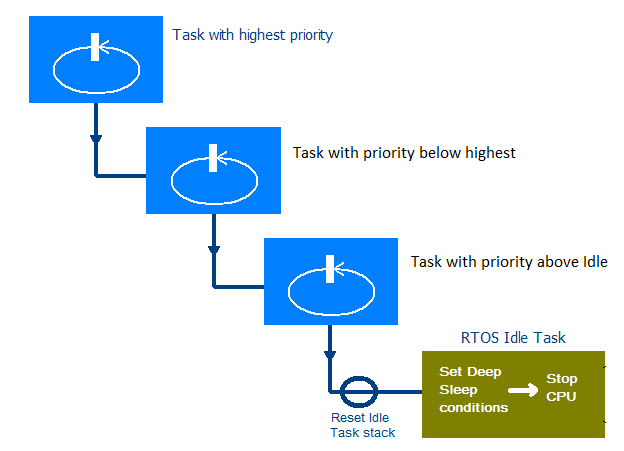

  

## TNKernel Power Management Demo

## Description

  This example shows the usage of the sleep and deep sleep operating modes with the low-power  
 microcontrollers (the project is for the TI MSP430X MCU, but any other low power MCU may be used).  
The demo project uses TNKernel RTOS ver.3.0  

  The switching to the sleep and deep sleep modes is implemented automatically and very efficiently.  
The approach removes unnecessary active time and gains sleep/deep-sleep performance.  

    **1.   CPU sleep mode**

    Each time, when the all tasks finished their current jobs and the system going into the idle task,  
 the system checks the deep sleep conditions(see below).  

   If there are no deep sleep conditions, the systems goes to the sleep mode:  

   • The CPU is stopped (in LP3 mode)  
   • An appropriate hardware is set to the sleep mode  

 All peripheral devices are remained unchanged.  
 Any system interrupt will be push the CPU to the regular operating mode.  

    **2.   Deep sleep concept**

   The Deep Sleep mode assumes the operating with minimal possible power consumption.  
 In the Deep Sleep mode:  

 • The CPU is stopped (in LP3 mode).  
 • The crystal oscillator 20 MHZ is disabled and CPU clock (5 MHz) is generated from the crystal 32768Hz.  
 • The RS485 interface power is off.  
 • The SD card power is off.  
 • All LEDs are off.  
 • All DC/DC converters are off.  
 • JTAG is off.  
 • All Input pins that provides the power consumption in the regular.  operating mode, in Deep Sleep mode are set as the outputs with appropriate logical level.  
 • RTC update interrupt (each 1 sec) is disabled.  
 • RTOS ticks interrupt is disabled (!).  

  The hardware running in Deep Sleep mode:  

 • 32768 Hz crystal oscillator(Inside CPU)  
 • RTC and RTC alarm hardware(Inside CPU)  
 • Buttons input port(the button's interrupt is enabled)  

 To recover the Device from the deep sleep mode back to the regular operating mode, the following interrupts are used:  

 • Button(s) pressing  
 • RTC alarm interrupt  

    **3.   Checking Deep Sleep conditions**

   The Deep Sleep conditions(see above) are set as:  

 • There are no tasks jobs now and the tasks are waiting in an apropriate input queues(message boxes).  
   It is assumes here that each task supports a single input queue (message box) to obtain requests(messages) for the executing.  
 • All shared resurces (RTC, long term timers etc.) are free now - an appropriate semaphores counters are greater than 0\.  
 • There are no active user timers.  
 • The reference counters for the user resources (UART, SD Card, LEDs, etc.) are 0 - the resources are not in use.  
 • The CPU clock source is generated from the crystal 32768 Hz.  

   The systems checks the Deep Sleep conditions in the Idle task before CPU goes to the low-power mode.  

    **4.   The general deep sleep mode switching problem and a solution**

  The picture below illustrates a general deep sleep mode switching problem.  
  Let's assume that we set all deep sleep conditions properly, but an interrupt came exactly before executing  
 "Stop CPU" operation. After finishing the interrupt processing, the execution will return to the "Stop CPU" operation.  
 Unfortunately, in the most cases, inside ISR processing, the Deep Sleep conditions were broken. It means,  
 that when CPU will be stopped, the system will have an inconsistent conditions.  

  The way to solve the problem - reset the Idle task stack at the context switch routine (see the picture below).  

   The RTOS resets an Idle task stack to default values at the context switch to the Idle task.  
 It means that we will always return to the beginning of the Idle task's task function and 'Set Deep Sleep condition' routine will be executed again.The procedure may be repeated as many time as necessary  
until the "Stop CPU" operation will performed.  

    **5.   LTT - Long term timers**

   When the system is in the Deep Sleep mode, the RTOS ticks are disabled - regular RTOS system and user timers do not works.  
The long term timers (LTT) uses the RTC alarm like the engine and works regardless the RTOS operating mode.  
In many CPUs the RTC alarm system does not supports seconds and the LTT library uses a resolution +/- 1 min.  

    **6.   The demo project description**

   The demo project contains two system tasks:  

 • _tn_os_tick_task_ (priority 0)  
 • _tn_idle_task_(as part of the RTOS)  

 In the _tn_os_tick_task_, besides timers processing, also LEDs and buttons handlers are running.  
 In the _tn_idle_task_, the hook function _idle_hook_func()_ does processing of the sleep and deep sleep facilities.  

  The two project operating tasks (_task_user_hipri_ and _task_SysOp_) uses the "actor" model -  
each task has an input queue (TNKernel message box) and the sub-systems uses the messages to notify the  
operating tasks about requested jobs.  

  The project uses 2 buttons (Button_1 and Button_2) and 2 LEDs (LED_ID_1 and LED_ID_2).  

   When the Button_1 is pressed and holds - LED_ID_1 blinks.  

   The Button_2 is used by as the wakep-up interrupt source when the system is in the deep sleep mode.  

   LTT timer is used to generate 2 min event (regardless the regular operating or Deep Sleep mode)  
 to perform 'job2' (LED_ID_2 blink 2 times, pause 5 sec, LED_ID_2 blink 3 times)  

    A debug terminal uses RS485 UART (38400 baud, 8 bits, 1 stop bit, no parity) - when RS485 is on, deep sleep is prevented. Debug terminal may be closed by the terminal 'rs485 off' command (the system goes to deep sleep)  

## License

<table cellpadding="0" cellspacing="0" border="0" id="table1" class="sortable">

<tbody>

<tr>

<td>BSD</td>

</tbody>

</table>

© 2005, 2017 **Yuri Tiomkin**

